# WebApp / マイコン 設計

## 1. WebApp UI仕様

- 起動時は **MANUALモード**として表示する。
- 操作ボタン：
  - ↑ 前進
  - ↓ 後退
  - ← 左
  - → 右
  - STOP
- 方向ボタンは押している間だけ操作し、離したら `STOP` を送信する。
- **MANUAL / AUTO切替ボタン**を配置する。
- **カメラ映像**をメイン画面に表示する。
- 前方距離 `front_distance_mm` を表示する。
- 通信状態 **CONNECTED / DISCONNECTED** を表示する。
- `stop_reason` を表示する。
- TOR発生時は画面上にオーバーレイを表示する。
  - `TAKE OVER REQUEST`
  - 残り時間 `tor_remaining_ms`
  - 「手動操作へ切替」ボタン
- **Emergency Stop** ボタンを配置する。
- SAFE/DANGERなどのAI危険度表示はテスト版では入れない。

### 重要な設計方針

WebAppの表示する `mode` は、ボタン操作によって直接変更しない。

```text
WebApp → mode_request → マイコン
                         │
                         │ mode
                         ▼
WebApp ← 現在状態 ←──────┘
```

**マイコンを `mode` のSource of Truth（唯一の正）とする。**

---

## 2. 通信データ

### WebApp → マイコン

| データ | 内容 |
|---|---|
| `manual_direction` | `FORWARD / BACKWARD / LEFT / RIGHT / STOP` |
| `mode_request` | `MANUAL / AUTO` |
| `emergency_stop_request` | Emergency Stop要求 |
| TOR時の手動切替 | `mode_request=MANUAL` で対応 |

### マイコン → WebApp

| データ | 内容 |
|---|---|
| `mode` | `MANUAL / AUTO / SAFE_STOP / EMERGENCY_STOP` 等 |
| `front_distance_mm` | 前方距離 |
| `tor_active` | TOR発生中か |
| `tor_remaining_ms` | TORの残り時間 |
| `stop_reason` | 停止理由 |
| `camera_image` | カメラ映像 |
| 接続情報 | WebAppが通信状態を判断するためのHeartbeat等 |

### TORの扱い

TOR（Take Over Request）は `mode` ではない。

```text
mode = AUTO
tor_active = false
```

が通常のAUTO、

```text
mode = AUTO
tor_active = true
tor_remaining_ms = 3500
```

がTOR発生中のAUTOである。

WebApp上では後者を **AUTO_TOR** として扱う。

引き継ぎが完了すると、

```text
mode = MANUAL
tor_active = false
```

となる。

---

# 3. WebApp状態遷移

WebAppはマイコンから受信した `mode` / `tor_active` をもとに表示状態を更新する。

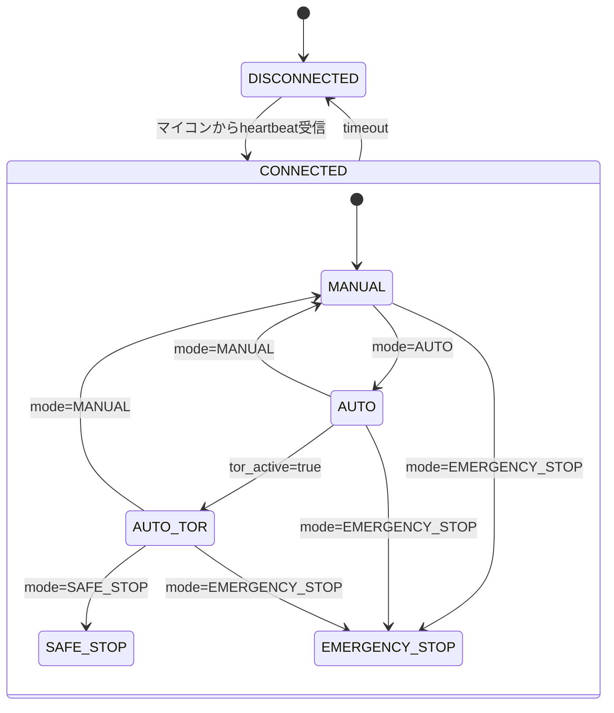

`mode_request`を送信しただけではWebAppの表示状態は変更しない。

---

# 4. MANUALモード内の操作

MANUALはモードであり、その内部に方向操作状態を持つ。

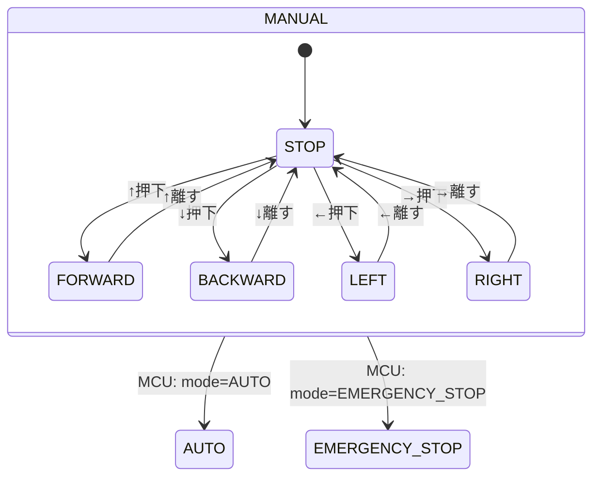

方向操作では、

```text
↑ 押下  → manual_direction=FORWARD
↑ 離す → manual_direction=STOP

↓ 押下  → manual_direction=BACKWARD
↓ 離す → manual_direction=STOP

← 押下  → manual_direction=LEFT
← 離す → manual_direction=STOP

→ 押下  → manual_direction=RIGHT
→ 離す → manual_direction=STOP
```

---

# 5. 主要状態遷移

## 5.1 MANUAL → AUTO

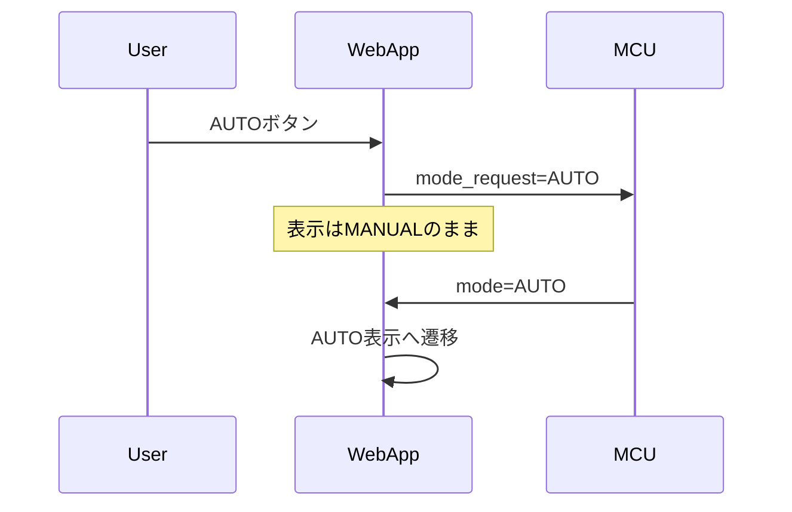

## 5.2 AUTO → MANUAL

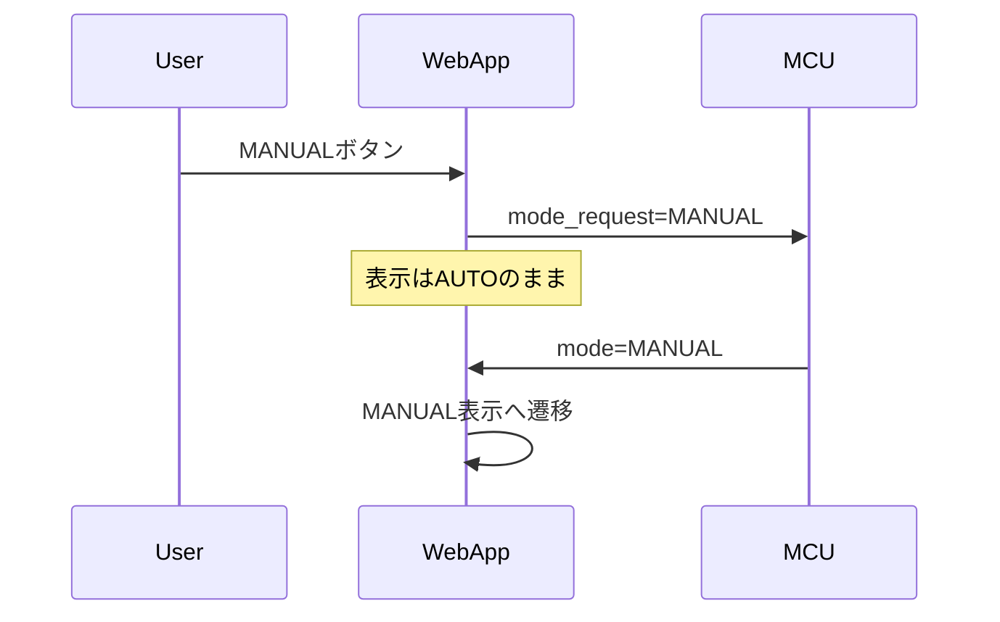

## 5.3 AUTO → AUTO_TOR

TORの発生条件はマイコン側が判断する。

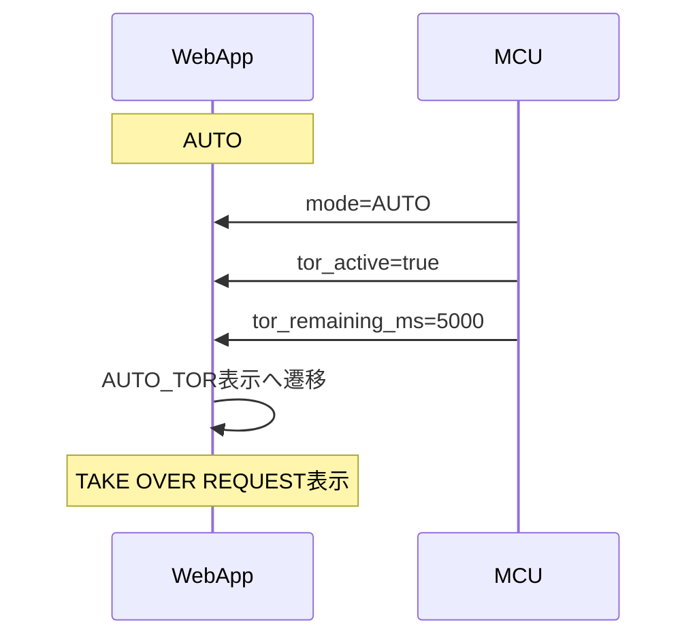

## 5.4 AUTO_TOR → MANUAL

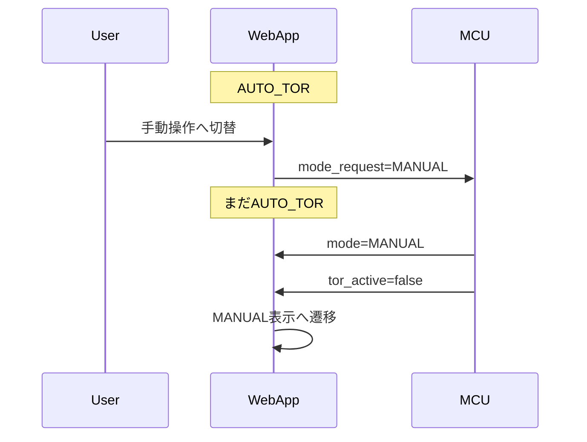

## 5.5 AUTO_TOR → SAFE_STOP

TORの時間切れはマイコン側で処理する。

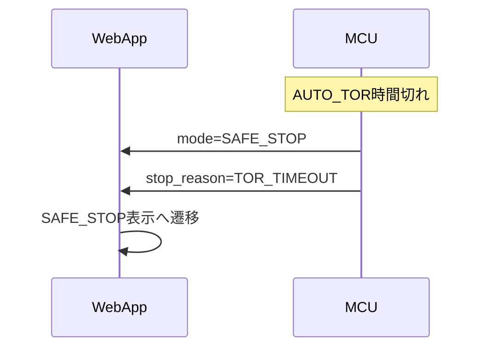

## 5.6 Emergency Stop

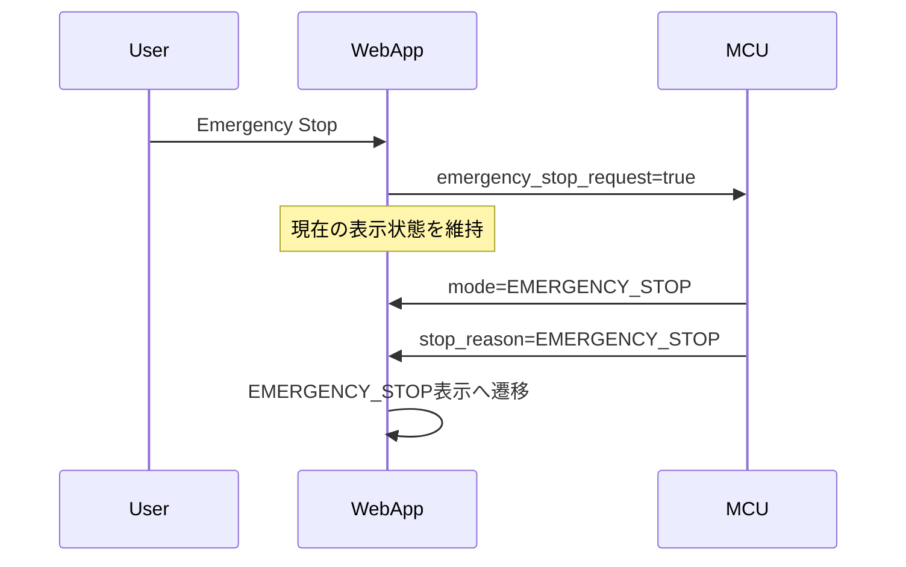

## 5.7 SAFE_STOP → MANUAL / AUTO

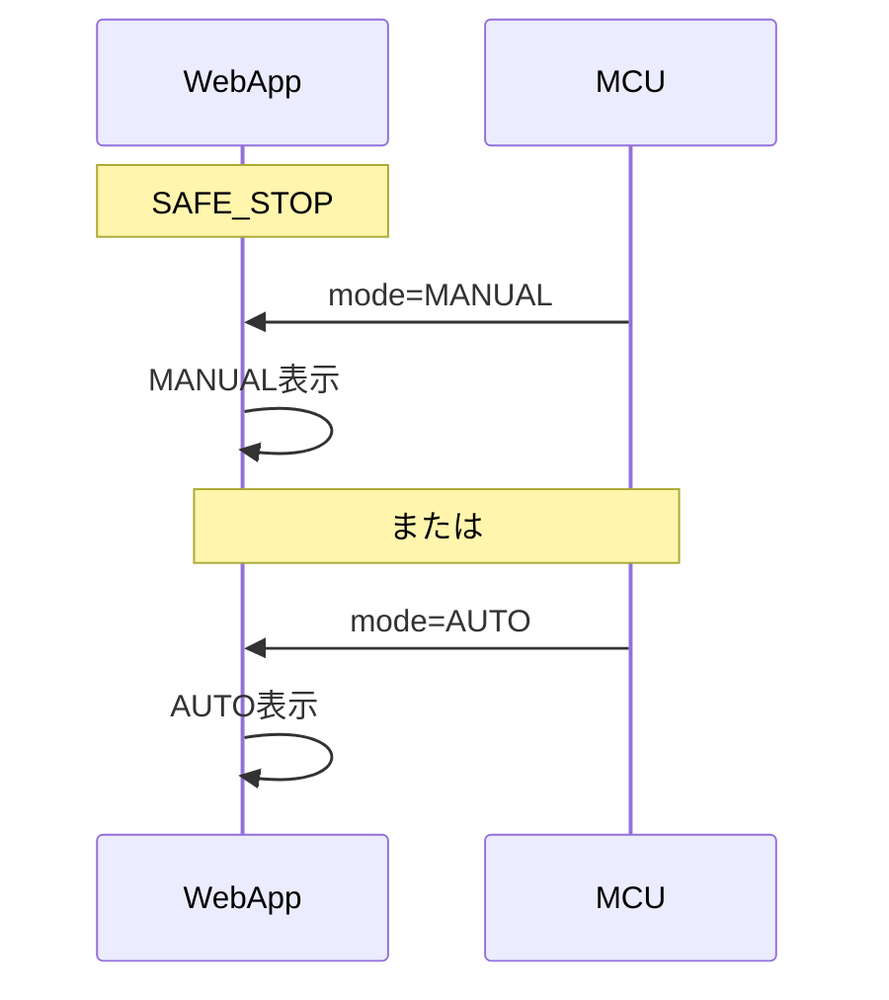

---

# 6. Heartbeatによる状態同期

Heartbeatは、マイコンの現在状態を定期的にWebAppへ通知するために使用する。

Heartbeatには、少なくとも以下の状態情報を含める。

- `mode`
- `front_distance_mm`
- `tor_active`
- `tor_remaining_ms`
- `stop_reason`

`camera_image` はHeartbeatとは分離する。

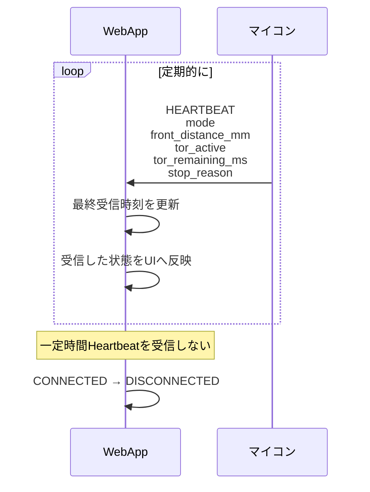

---

# 7. 通信全体

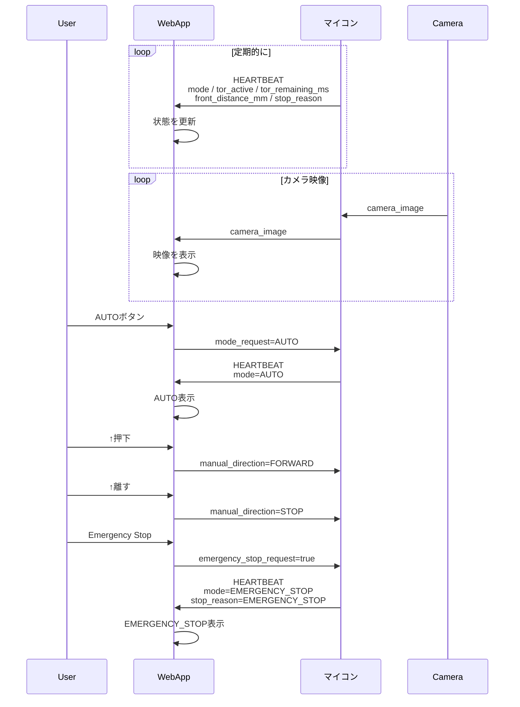

---

# 8. 最終的な責務分担

```text
                    WebApp
                      │
       ┌──────────────┼──────────────┐
       │              │              │
   ユーザー入力     UI表示       接続監視
       │              │              │
       │              ↑              │
       ↓              │              ↓
 mode_request       mode         heartbeat timeout
 manual_direction   sensor data
 emergency_stop     TOR情報
       │              ↑
       └──────→ MCU ←─┘
                  │
                  │
          状態を決定する主体
          Source of Truth
```

### 設計上の原則

1. **MCUが `mode` のSource of Truth**
2. WebAppは `mode_request` を送るだけで、表示状態を直接変更しない
3. WebAppはHeartbeatでMCUの現在状態を継続的に同期する
4. TORは `mode` ではなく、`mode=AUTO + tor_active=true` で表現する
5. WebApp上ではこの状態を `AUTO_TOR` として表示する
6. TOR引き継ぎ完了後は `mode=MANUAL`
7. TORタイムアウト後は `mode=SAFE_STOP`
8. Emergency Stopはどの操作状態からでも要求可能
9. 方向操作は押下中のみ送信し、リリース時に `STOP`
10. カメラ映像はHeartbeatとは別の通信経路・ストリームとして扱う
