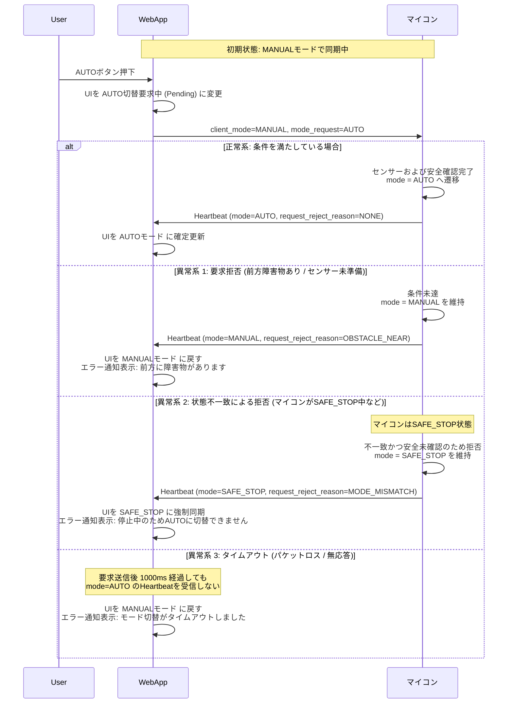
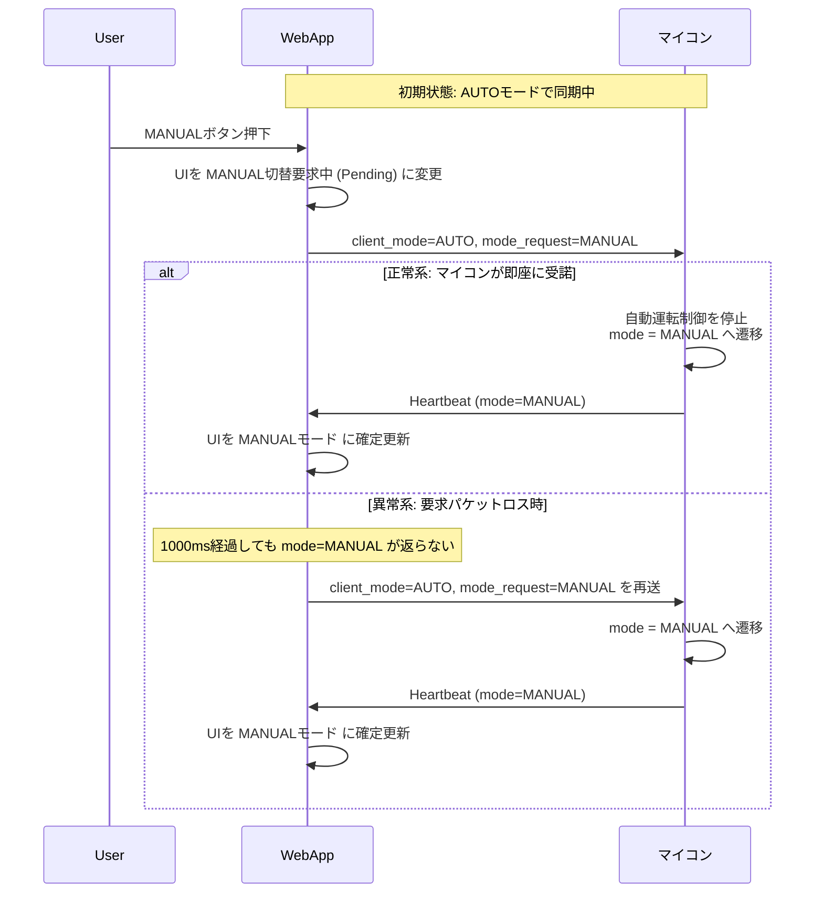
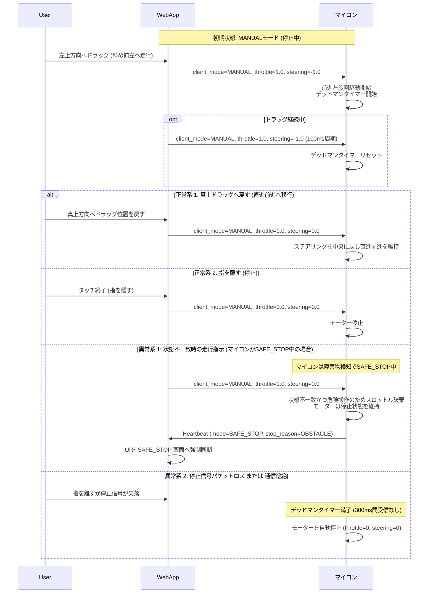
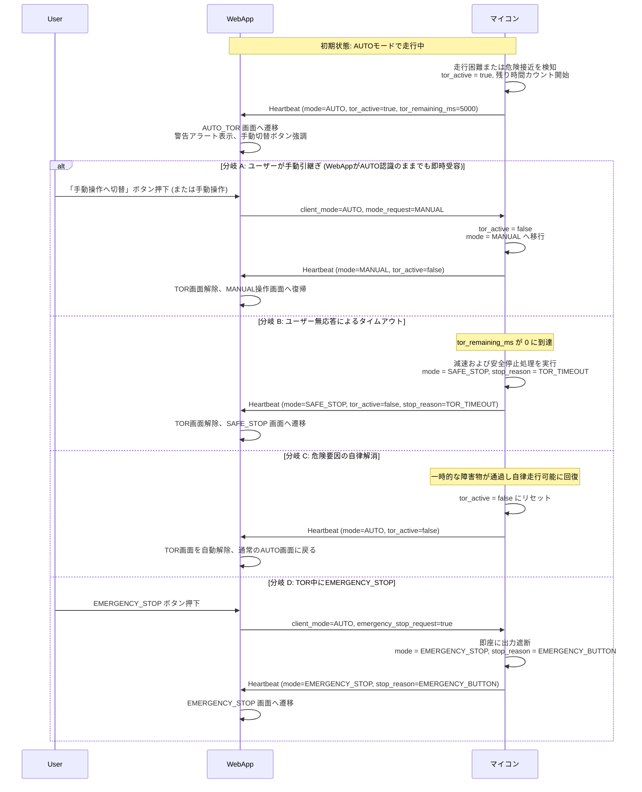
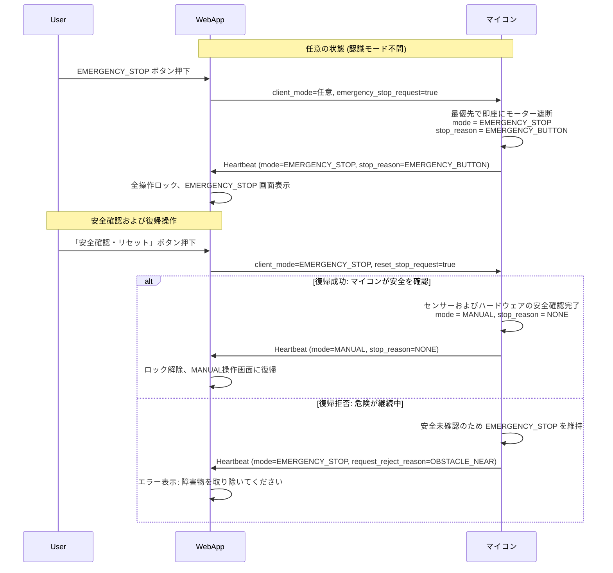
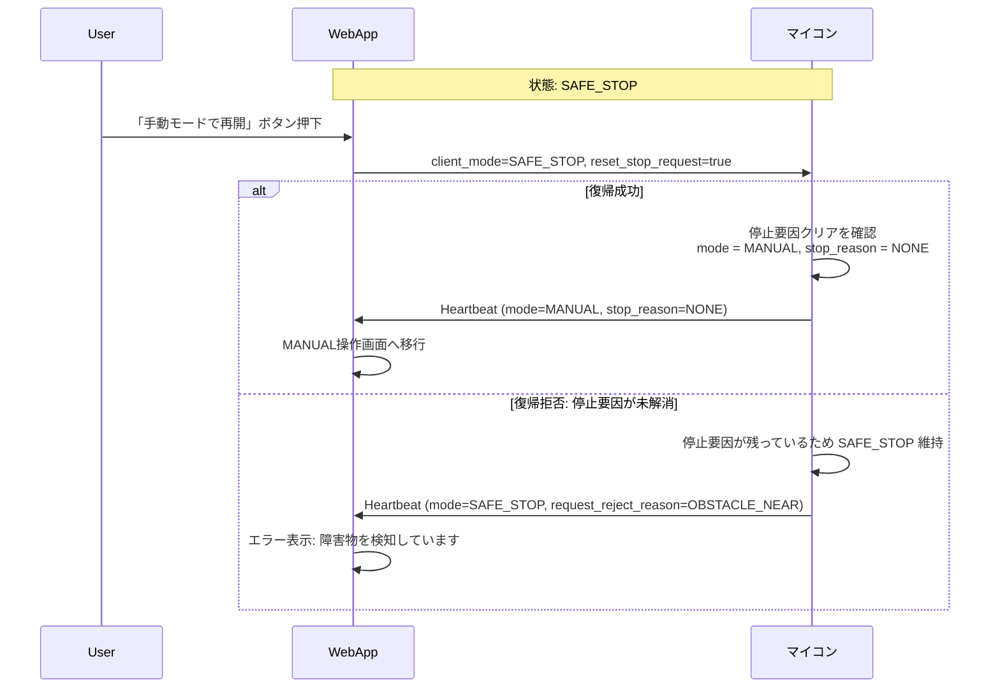
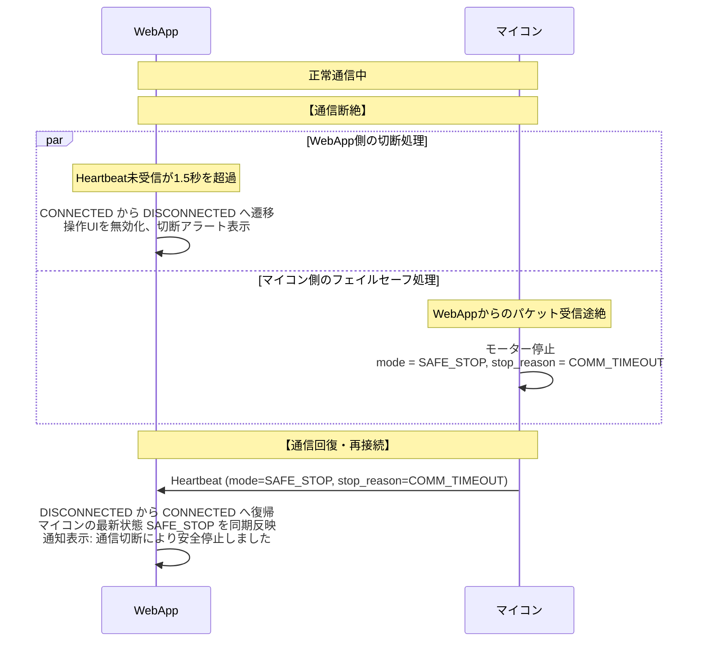

# 状態遷移・シーケンス図集

本ドキュメントでは、WebApp と 車載マイコン（MCU）間の対話フローを、正常系・異常系・フェイルセーフの各シナリオにおけるシーケンス図として網羅します。

## 1. モード切替: MANUAL → AUTO

WebAppからAUTO要求を出した際、マイコンの状態判定により分岐します。

## 2. モード切替: AUTO → MANUAL

手動運転への復帰は安全確保のため、マイコン側で最優先で即時受諾されます。

## 3. MANUALモードの方向操作と通信途絶（2軸仮想ジョイスティック・斜め走行）

## 4. TOR（Take Over Request）のライフサイクル

AUTO走行中、マイコンが自律走行困難を検知した際のシナリオ（障害物接近、白線ロスト、センサー信頼性低下など）。

## 5. EMERGENCY_STOP の発報と復帰手順

## 6. SAFE_STOP からの復帰シーケンス

## 7. 通信切断と再接続

## 8. 関連ドキュメント

- [システム全体構成・アーキテクチャ設計書](file:///home/rsny/mini-4wd-webapp/docs/system-architecture.md)
- [WebApp UI仕様・画面遷移設計書](file:///home/rsny/mini-4wd-webapp/docs/ui-spec.md)
- [通信プロトコル仕様書](file:///home/rsny/mini-4wd-webapp/docs/protocol.md)
