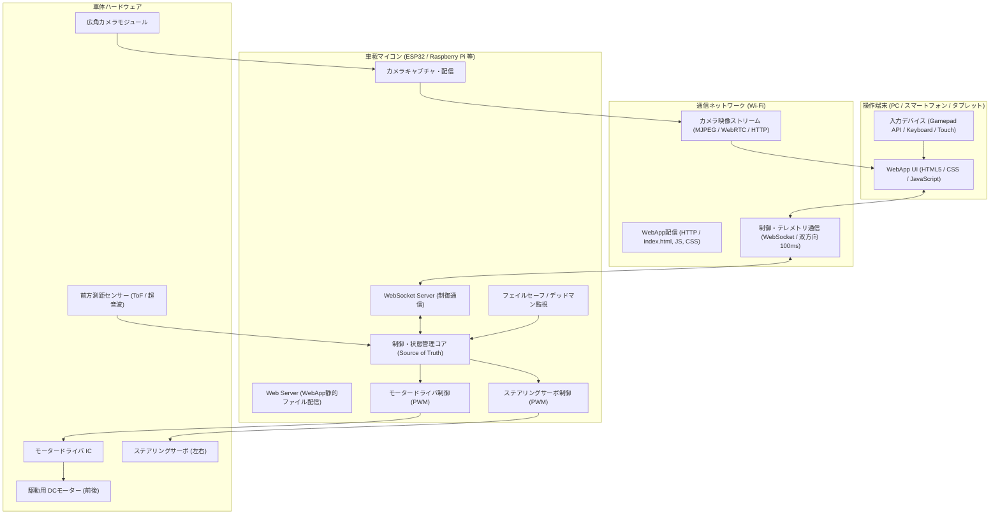
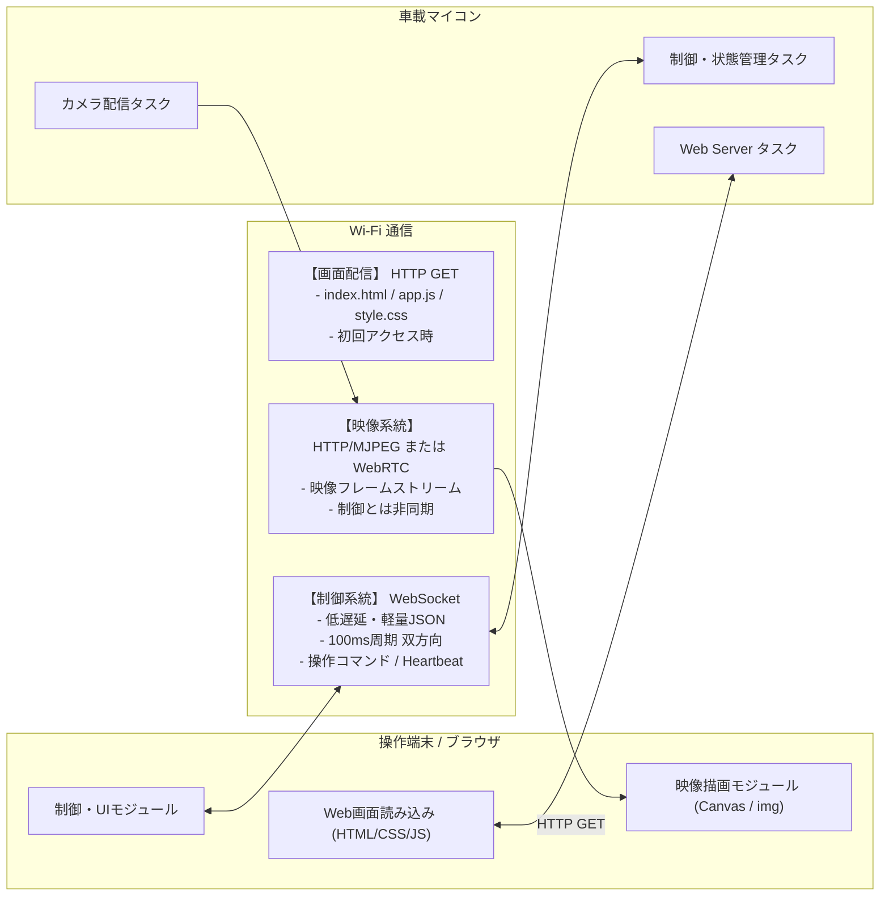
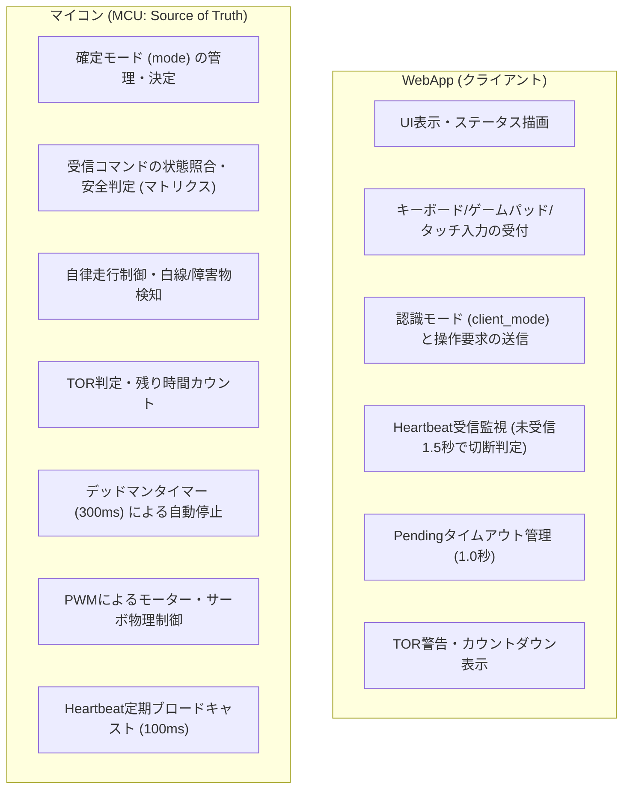

# システム全体構成・アーキテクチャ設計書

本ドキュメントでは、ミニ四駆自動運転システムにおける WebApp、車載マイコン、ハードウェア各コンポーネントの全体構成、通信系統、および責務分担について定義します。

---

## 1. システム全体構成図

---

## 2. 通信系統設計
車載マイコンは以下の3つの役割・通信経路を提供します。

1. **WebApp配信系統（HTTP GET）**
   - 操作端末がマイコンのIP/ポート（例: `http://localhost:8765/` や `http://192.168.4.1:8765/`）にアクセスすることで、マイコンから直接Web操作画面（HTML/JS/CSS）を配信します。
2. **制御・テレメトリ系統（WebSocket）**
   - 操作コマンドの送信、マイコンからの定期Heartbeat（テレメトリ）送信用。
   - 軽量なJSONフォーマットを用い、100ms周期で低遅延にやり取りします。
3. **映像配信系統（MJPEG / WebRTC / HTTP Stream）**
   - カメラ映像専用のストリーム。
   - 制御通信のパケット遅延やブロッキングを防ぐため、完全に独立した経路として扱います。

---

## 3. WebApp と マイコンの責務分担

### 責務分担の基本ルール

| 項目 | WebApp (UI) | 車載マイコン (MCU) |
|---|---|---|
| **モード決定権** | **なし**（要求 `mode_request` を送るのみ） | **あり（Source of Truth）** |
| **画面・操作状態** | マイコンの Heartbeat に基づき確定更新 | 自身の内部状態を Heartbeat で返信 |
| **手動走行指示** | スロットル/ステアリングの数値を定期送信 | 状態照合・デッドマン監視の上でPWM出力 |
| **異常停止** | 非常停止要求、停止中の操作ロック | 非常停止・障害物停止・自動出力遮断 |
| **通信監視** | 1.5秒途絶で `DISCONNECTED` 表示 | 300ms途絶でモーター停止、通信断で `SAFE_STOP` |

---

## 4. 関連ドキュメント

- [UI仕様・画面遷移図](file:///home/rsny/mini-4wd-webapp/docs/ui-spec.md)
- [通信プロトコル仕様書](file:///home/rsny/mini-4wd-webapp/docs/protocol.md)
- [状態遷移・シーケンス図集](file:///home/rsny/mini-4wd-webapp/docs/sequences.md)
