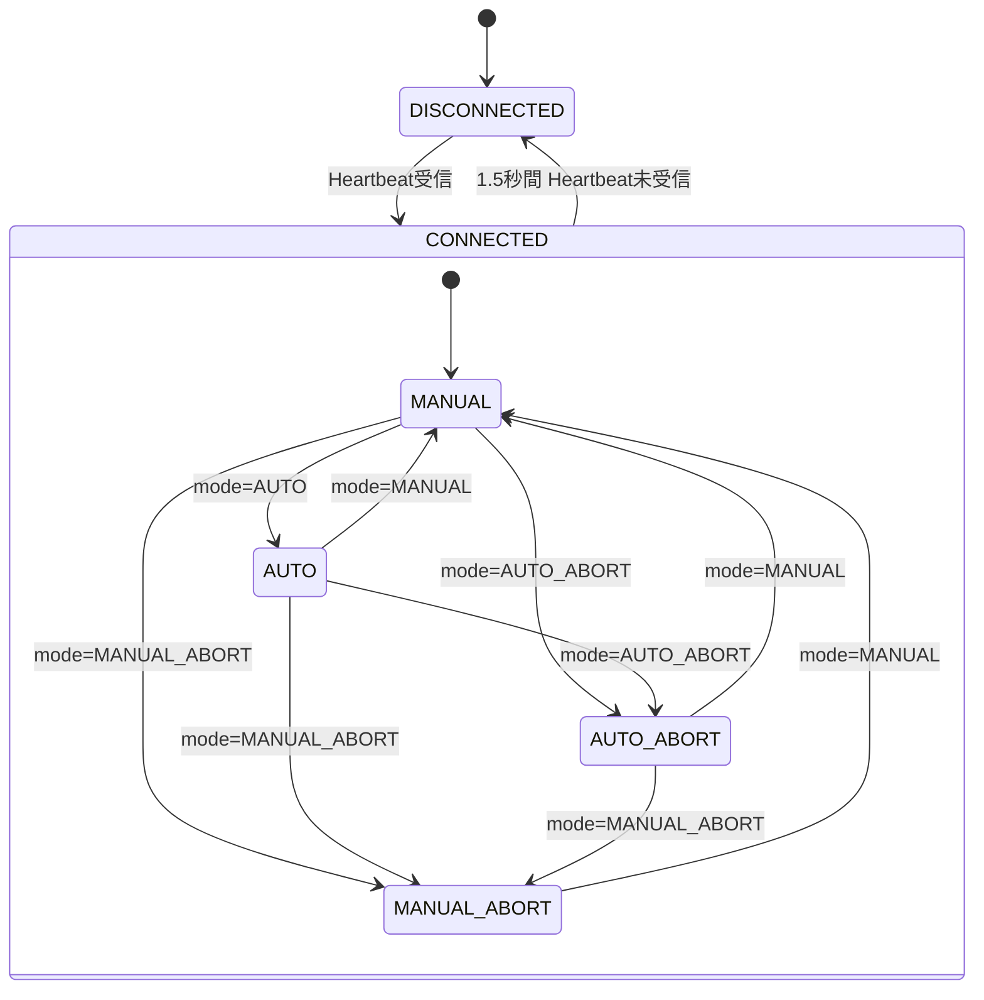
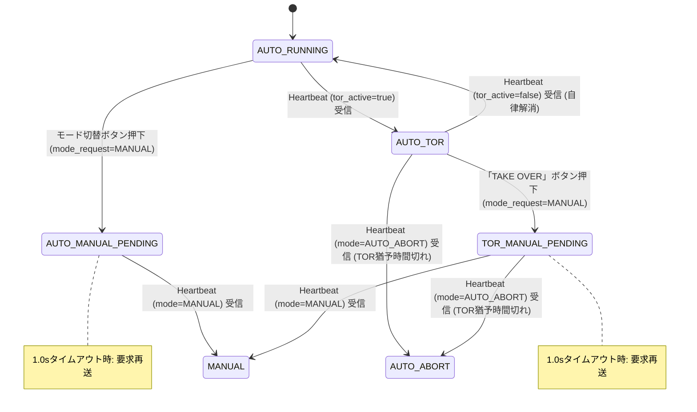
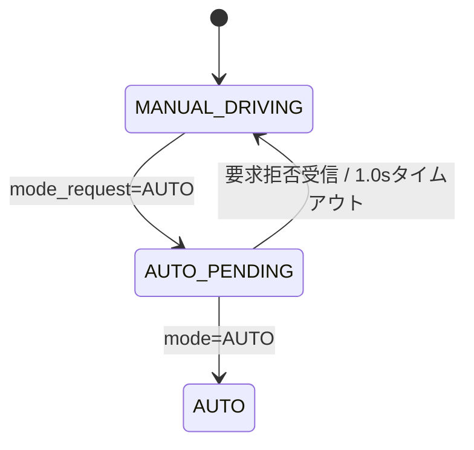
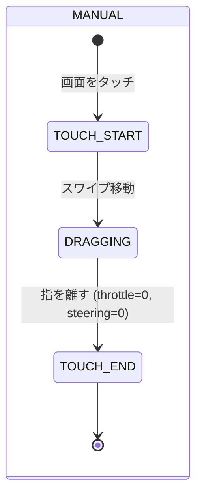

# WebApp UI仕様・画面遷移設計書

本ドキュメントでは、ミニ四駆自動運転 WebAppの画面構成、UI状態遷移、モバイル操作入力仕様、および各モードにおける操作可否マトリクスについて定義します。

## 1. UI画面状態遷移図

WebAppはマイコンからのHeartbeatを監視し、現在のモードおよび通信状態に応じてUI状態を遷移させます。

### 1.1 全体UIモード状態遷移図

マイコンの確定モード（`mode`）および通信状態に基づく全体の基本遷移です。

### 1.2 AUTOモード状態遷移図

`AUTO` モード中における自律走行、TOR（運転引継ぎ要求）、および手動復帰 Pending 状態の詳細フローです。

### 1.3 MANUALモード状態遷移図

`MANUAL` モードから `AUTO` への切替要求中（Pending）とタイムアウト・拒否時のフローです。

## 2. 各モードにおけるUI表示・操作可否マトリクス

### 操作可否一覧表

| 親モード | UI状態 | スロットル / ステアリング | モード切替ボタン | ABORT / RESET ボタン | 画面表示・アラート |
|---|---|---|---|---|---|
| **MANUAL** | **MANUAL (通常手動)** | **有効**（操作送信） | 有効（表示: `MANUAL MODE` / 押下で `AUTO` 要求） | **有効**（「ABORT」即時発報） | FPVカメラ映像、前方距離HUD |
| | **AUTO_PENDING** | 無効（ロック） | 無効（表示: `AUTO MODE` / 点滅Pending） | **有効**（「ABORT」即時発報） | 自動運転切替要求中（ボタン点滅） |
| **AUTO** | **AUTO_RUNNING (通常自動)** | 無効（ロック） | 有効（表示: `AUTO MODE` 反転 / 押下で `MANUAL` 要求） | **有効**（「ABORT」即時発報） | 自動運転中ステータス表示（白黒反転バッジ） |
| | **AUTO_MANUAL_PENDING** | 無効（ロック） | 無効（表示: `MANUAL MODE` / 点滅Pending） | **有効**（「ABORT」即時発報） | 手動復帰要求中表示（1s毎再送） |
| | **AUTO_TOR** | 無効（引継ぎ優先） | 無効（ロック） | **有効**（「ABORT」即時発報） | **白枠点滅オーバーレイ**、カウントダウン、TAKE OVERボタン |
| | **TOR_MANUAL_PENDING** | 無効（引継ぎ処理中） | 無効（ロック） | **有効**（「ABORT」即時発報） | **白枠点滅オーバーレイ**、カウントダウン、TAKE OVERボタン点滅（1s毎再送） |
| **AUTO_ABORT** | **AUTO_ABORT** | 無効（ロック） | 無効（ロック） | **有効**（「RESET」再開要求） | 中断理由（障害物/タイムアウト等）HUD表示 |
| **MANUAL_ABORT** | **MANUAL_ABORT** | 無効（完全ロック） | 無効（ロック） | **有効**（「RESET」再開要求） | **白黒点滅アラート**、中断理由表示 |
| **DISCONNECTED** | **DISCONNECTED** | 無効（完全ロック） | 無効（ロック） | 無効 | 切断オーバーレイ（自動再接続試行） |

## 3. 手動操作入力仕様

### 3.1 ワンハンド 2D ジョイスティック操作
画面の任意の位置をタッチするとジョイスティックが現れ、1本の指で直感的に前後（スロットル）および左右（ステアリング）を同時制御できます。

- **タッチ開始（Pointer Down）**: 画面上のタッチ位置を中心とする仮想ジョイスティックベースを表示。
- **ドラッグ操作（Pointer Move）**:
  - **上下ドラッグ**: スロットル（上: 前進 `0.0 〜 1.0`、下: 後退 `0.0 〜 -1.0`）
  - **左右ドラッグ**: ステアリング（右: 右旋回 `0.0 〜 1.0`、左: 左旋回 `0.0 〜 -1.0`）
  - **斜めドラッグ**: スロットルとステアリングの同時入力（旋回走行）
- **タッチ終了（Pointer Up / Cancel）**: 指を離すと即座にベースが非表示になり、スロットル・ステアリングともに `0.0`（ニュートラル・ブレーキ）へ自動復帰。

### 3.2 操作入力と送信データの組み合わせ

| 操作入力 (タッチスワイプ) | `throttle` | `steering` | 車両の挙動 |
|---|---|---|---|
| タッチなし（ニュートラル） | `0.0` | `0.0` | 停止・中立 |
| 上スワイプ | `1.0` | `0.0` | 直進前進 |
| 下スワイプ | `-1.0` | `0.0` | 直進後退 |
| 左スワイプ | `0.0` | `-1.0` | その場左ステアリング |
| 右スワイプ | `0.0` | `1.0` | その場右ステアリング |
| 右上スワイプ | `1.0` | `1.0` | **前進右旋回（斜め前右）** |
| 左上スワイプ | `1.0` | `-1.0` | **前進左旋回（斜め前左）** |
| 右下スワイプ | `-1.0` | `1.0` | **後退右旋回（斜め後右）** |
| 左下スワイプ | `-1.0` | `-1.0` | **後退左旋回（斜め後左）** |

## 4. 特殊画面仕様

### 4.1 TOR（Take Over Request: 運転引継ぎ要求）オーバーレイ
- **発生契機**: マイコンの Heartbeat で `tor_active = true` を検知した瞬間。
- **表示内容**:
  - 白枠点滅パルス警告。
  - 残り時間 `tor_remaining_ms` のリアルタイムカウントダウン（例: `4.5s`）。
  - 中央に特大の **「TAKE OVER」ボタン** を表示。

### 4.2 MANUAL_ABORT / AUTO_ABORT（中断）画面
- **表示内容**:
  - モノクロ反転点滅HUD警告表示（MANUAL_ABORT時）。
  - スロットル/ステアリングの完全無効化。
  - 中断理由（`MANUAL_ABORT_BUTTON` / `OBSTACLE` 等）を明示。
  - **「RESET」ボタン** を表示。

### 4.3 DISCONNECTED（通信切断）オーバーレイ
- **発生契機**: Heartbeat が 1.5秒 以上途絶えた場合。
- **表示内容**:
  - 半透明黒オーバーレイとミニマルスピナー表示。
  - 自動再接続ループ（1.5秒周期）を実行。
