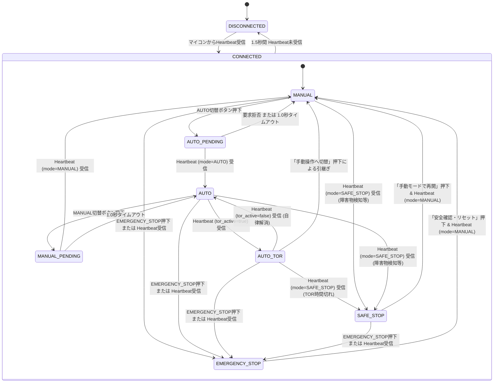
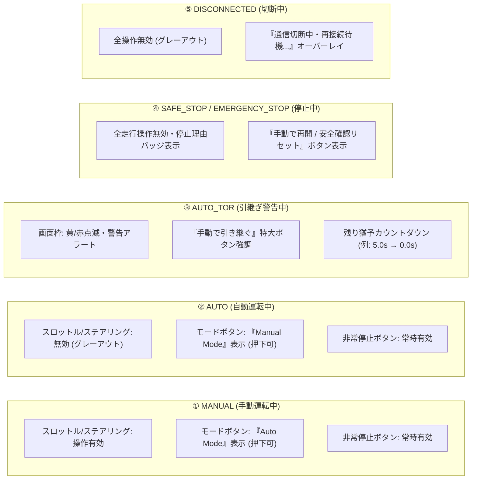
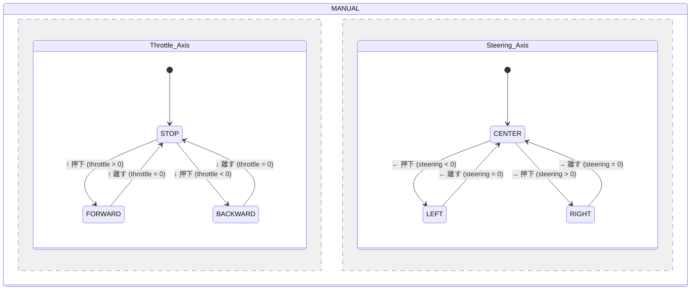

# WebApp UI仕様・画面遷移設計書

本ドキュメントでは、ミニ四駆自動運転 WebApp の画面構成、UI状態遷移、操作入力仕様、および各モードにおける操作可否マトリクスについて定義します。

---

## 1. UI画面状態遷移図

WebAppはマイコンからのHeartbeatを監視し、現在のモードおよび通信状態に応じてUI状態を遷移させます。

---

## 2. 各モードにおけるUI表示・操作可否マトリクス

### 操作可否一覧表

| UI状態 | スロットル / ステアリング | モード切替ボタン | 非常停止ボタン | 復帰 / リセットボタン | 画面表示・アラート |
|---|---|---|---|---|---|
| **MANUAL** | **有効**（操作送信） | 有効（`AUTO` 要求） | **有効**（即時発報） | 非表示 | 通常操作画面、前方距離表示 |
| **AUTO_PENDING** | 無効 | 無効（「切替中...」） | **有効** | 非表示 | モード要求 Pending 表示 |
| **AUTO** | 無効（グレーアウト） | 有効（`MANUAL` 要求） | **有効** | 非表示 | 自動運転中ステータス表示 |
| **AUTO_TOR** | 無効（即時復帰ボタン優先） | 「手動で引き継ぐ」強調 | **有効** | 非表示 | **TOR警告オーバーレイ**、カウントダウン |
| **SAFE_STOP** | 無効（ロック） | 無効 | **有効** | **有効**（「手動で再開」） | 停止理由（障害物/タイムアウト等）表示 |
| **EMERGENCY_STOP** | 無効（完全ロック） | 無効 | 無効（発報済） | **有効**（「安全確認・リセット」） | **非常停止中アラート**、赤背景警告 |
| **DISCONNECTED** | 無効（完全ロック） | 無効 | 無効 | 無効 | 切断オーバーレイ（未接続表示） |

---

## 3. 手動操作入力仕様（2軸独立制御）

手動操作では、スロットル（前後）とステアリング（左右）の2軸を独立して並行管理します。

### 操作と送信データの組み合わせ

| 操作入力 (キーボード / ゲームパッド) | `throttle` | `steering` | 走行状態 |
|---|---|---|---|
| 入力なし | `0.0 (STOP)` | `0.0 (CENTER)` | 停止 |
| `↑` のみ | `1.0 (FORWARD)` | `0.0 (CENTER)` | 直進前進 |
| `↓` のみ | `-1.0 (BACKWARD)` | `0.0 (CENTER)` | 直進後退 |
| `↑` + `←` | `1.0 (FORWARD)` | `-1.0 (LEFT)` | **前進左旋回（斜め前左）** |
| `↑` + `→` | `1.0 (FORWARD)` | `1.0 (RIGHT)` | **前進右旋回（斜め前右）** |
| `↓` + `←` | `-1.0 (BACKWARD)` | `-1.0 (LEFT)` | **後退左旋回（斜め後左）** |
| `↓` + `→` | `-1.0 (BACKWARD)` | `1.0 (RIGHT)` | **後退右旋回（斜め後右）** |

### 入力制御ルール
- **定期送信**: キー押下中またはアナログスティック傾倒中は、100ms周期で最新の値を送信する。
- **中立自動復帰**: ボタンを離した軸は即座に `0.0` を送信し、マイコン側を停止/直進状態に戻す。
- **アナログ入力対応**: ゲームパッドのアナログスティックやUIスライダーからの連続値（`-1.0 〜 1.0`）も同様に反映可能。

---

## 4. 特殊画面仕様

### 4.1 TOR（Take Over Request: 運転引継ぎ要求）オーバーレイ
- **発生契機**: マイコンの Heartbeat で `tor_active = true` を検知した瞬間。
- **表示内容**:
  - 画面全体に黄色・赤色の点滅ボーダーを表示。
  - `⚠️ TAKE OVER REQUEST` の大型警告ヘッダー。
  - 残り時間 `tor_remaining_ms` のミリ秒単位リアルタイムカウントダウン（例: `3.5s`）。
  - 特大の **「手動操作へ切替」ボタン** を中央下部に強調表示。
- **解除契機**:
  - ユーザーが切替ボタンを押下（`mode_request=MANUAL` 送信）し、マイコンがMANUALへ遷移。
  - マイコンの自律解消（`tor_active=false`）。
  - 時間切れによりマイコンが `SAFE_STOP` へ遷移。

### 4.2 EMERGENCY_STOP（非常停止）画面
- **表示内容**:
  - 画面全体を赤基調の警告表示に変更。
  - 操作スライダー・方向キーの完全無効化。
  - 停止理由（`EMERGENCY_BUTTON` 等）を明示。
  - **「安全確認・リセット」ボタン** を表示。

### 4.3 DISCONNECTED（通信切断）オーバーレイ
- **発生契機**: Heartbeat が 1.5秒 以上途絶えた場合。
- **表示内容**:
  - 画面全体に半透明の黒オーバーレイを重ね、全UI操作を無効化。
  - `接続が切断されました。再接続を待機しています...` のスピナー表示。
  - 通信回復時に自動で最新状態（通常はSAFE_STOP）に同期復帰。

---

## 5. 関連ドキュメント

- [システム全体構成・アーキテクチャ設計書](file:///home/rsny/mini-4wd-webapp/docs/system-architecture.md)
- [通信プロトコル仕様書](file:///home/rsny/mini-4wd-webapp/docs/protocol.md)
- [状態遷移・シーケンス図集](file:///home/rsny/mini-4wd-webapp/docs/sequences.md)
